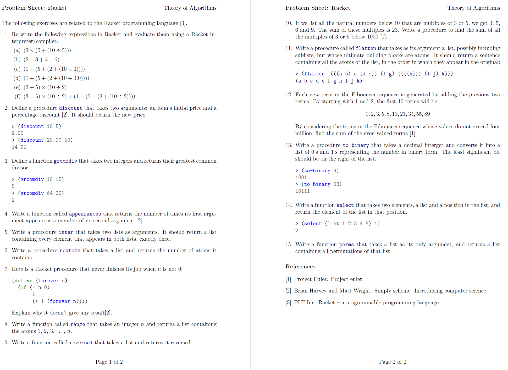
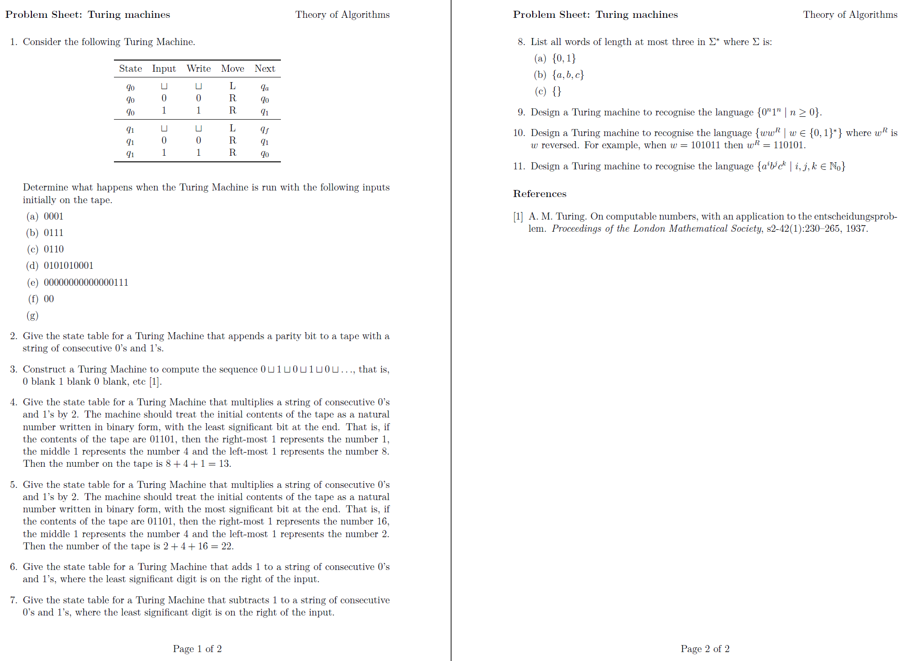

# 4 Year - Theory of Algorithms

## Problem Sheet: Racket
### [Solution](https://github.com/alexpt2000gmit/4Year_Theory_of_Algorithms/tree/master/1%20Racket)

## Problem Sheet: Turing machines
### [Solution](https://github.com/alexpt2000gmit/4Year_Theory_of_Algorithms/tree/master/2%20Turing%20machines)

### References: 
- https://ianmcloughlin.github.io/theoryofalgorithms

# Author

### Alexander Souza
- G00317835@gmit.ie
- alexpt2000@gmail.com
- https://github.com/alexpt2000gmit
- https://github.com/alexpt2000
- www.linkedin.com/in/alexander-souza-3a841539/