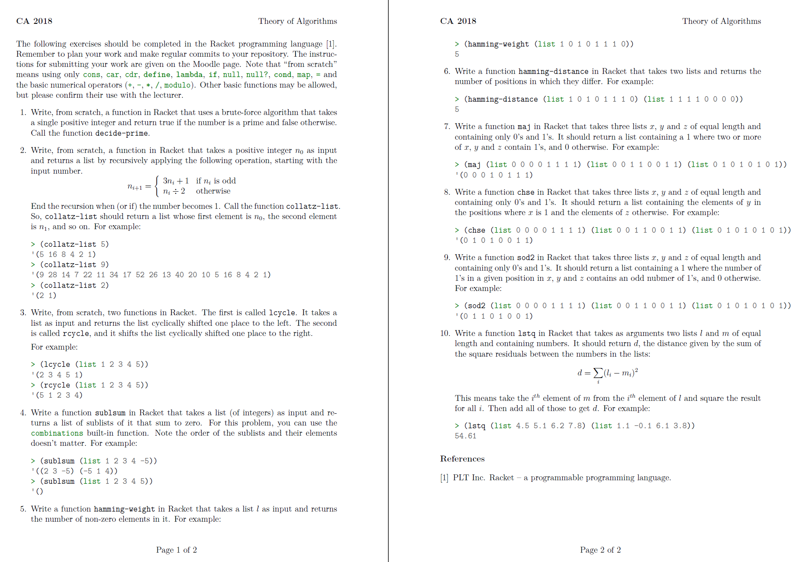

# 4 Year - Theory of Algorithms

## This repository contains functional programming problems and solutions using Racket

### What is Functional Programming?
Functional programming is the process of building software by composing pure functions, avoiding shared state, mutable data, and side-effects. Functional programming is declarative rather than imperative, and application state flows through pure functions. Contrast with object oriented programming, where application state is usually shared and colocated with methods in objects.

### What is Racket?
Racket is a general-purpose programming language as well as the world’s first ecosystem for developing and deploying new languages.

### Getting started with Racket!
You can find the full information here, but here's the summary

- Download and Install Racket, get it here

- Once installed launch Dr. Racket

- On Windows, you can start DrRacket from the Racket entry in the Start menu.

- On Mac OS, double click on the DrRacket icon. It is probably in a Racket folder that you dragged into your Applications folder.

- On Unix (including Linux), the drracket executable can be run directly from the command-line if it is in your path, which is probably the case if you chose a Unix-style distribution when installing.

You can also add Racket to the path or as an environmental variable if you want to run it from the terminal / command line, adding the path/to/the/racket/executable to the path environment variable.

## CA 2018
### [Solution](https://github.com/alexpt2000gmit/4Year_Theory_of_Algorithms/tree/master/CA%20-%20List%20of%20programming%20tasks)

## Problem Sheet: Racket
### [Solution](https://github.com/alexpt2000gmit/4Year_Theory_of_Algorithms/tree/master/1%20Racket)

## Problem Sheet: Turing machines
### [Solution](https://github.com/alexpt2000gmit/4Year_Theory_of_Algorithms/tree/master/2%20Turing%20machines)

### References: 
- https://ianmcloughlin.github.io/theoryofalgorithms

# Author

### Alexander Souza
- G00317835@gmit.ie
- alexpt2000@gmail.com
- https://github.com/alexpt2000gmit
- https://github.com/alexpt2000
- www.linkedin.com/in/alexander-souza-3a841539/